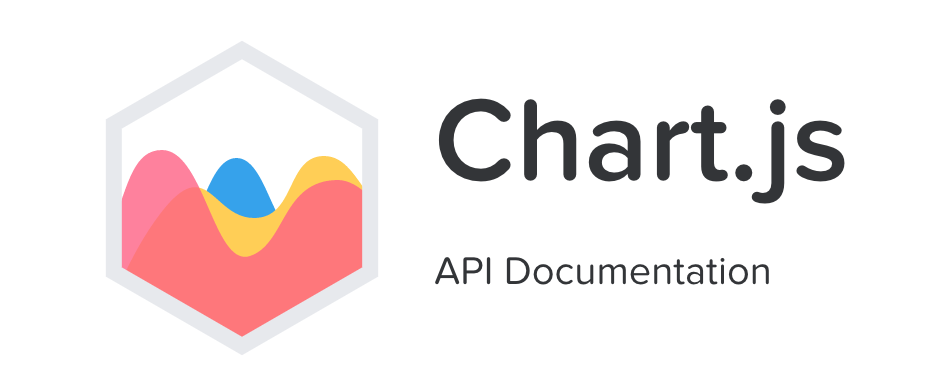
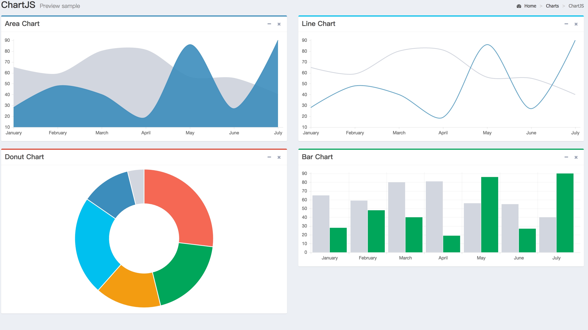
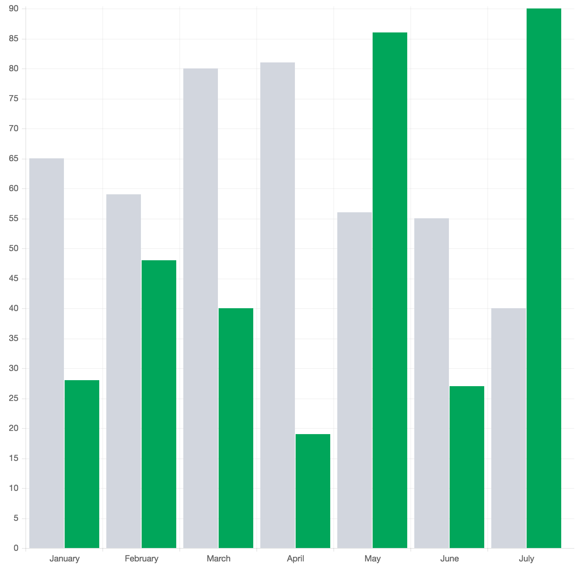
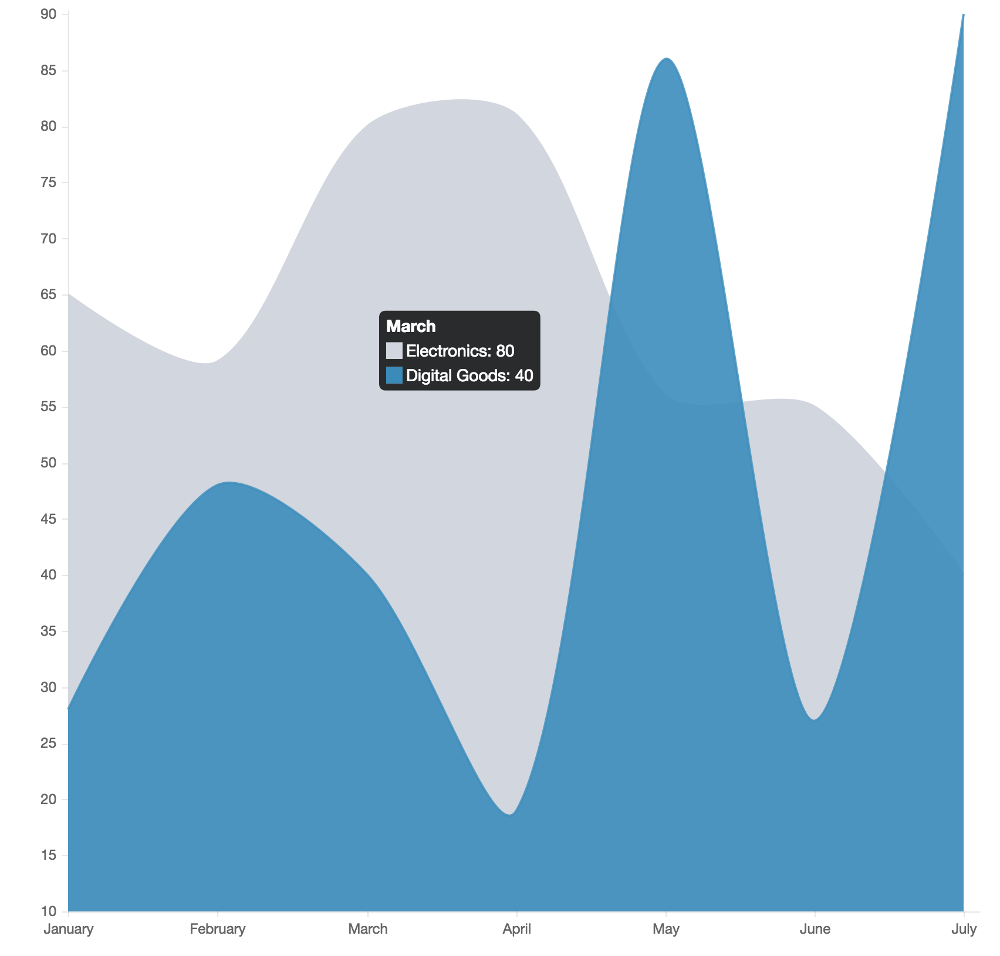

# 图表插件-Chart.js

## 前言


-----------------------------------------------


> 中文说明
 -   简单快捷的创建图标的插件
> 英文说明
 -   Simple yet flexible JavaScript charting for designers & developers
## 参考文

[官址](http://www.chartjs.org/)

[英文文档](http://www.chartjs.org/docs/)

[中文文档](http://www.bootcss.com/p/chart.js/docs/)

## 功能特点
-    1.制作混合类型图表(Mixed chart types)
>    Mix and match bar and line charts to provide a clear visual distinction between datasets.
-    2.制作轴类型图标(New chart axis types)
>    Plot complex, sparse datasets on date time, logarithmic or even entirely custom scales with ease.
-    3.令人惊叹的颜色、数据过度切换效果(Animate everything!)
>    Out of the box stunning transitions when changing data, updating colours and adding datasets.
-    4.chart是社区维护项目( Open source)
>    Chart.js is a community maintained project, contributions welcome!
-    5.8种不同方式的数据显示形式和可定制的动画效果(8 Chart types)
>    Visualize your data in 8 different ways; each of them animated and customisable.
-    5.支持IE9+的渲染性能(HTML5 Canvas)
>    Great rendering performance across all modern browsers (IE9+).
-    7.自适应的功能支持(Responsive)
>    Redraws charts on window resize for perfect scale granularity.
 
## 快速上手

- 引用文件 js css

```js
<script src="../../plugins/Chart.js"></script>
```

- 例子1:



html
```html 
<canvas id="myChart" width="400" height="400"></canvas>
```
js
```js
var areaChartData = {
        labels: ["January", "February", "March", "April", "May", "June", "July"],
        datasets: [
            {
                label: "Electronics",
                fillColor: "rgba(210, 214, 222, 1)",
                strokeColor: "rgba(210, 214, 222, 1)",
                pointColor: "rgba(210, 214, 222, 1)",
                pointStrokeColor: "#c1c7d1",
                pointHighlightFill: "#fff",
                pointHighlightStroke: "rgba(220,220,220,1)",
                data: [65, 59, 80, 81, 56, 55, 40]
            },
            {
                label: "Digital Goods",
                fillColor: "rgba(60,141,188,0.9)",
                strokeColor: "rgba(60,141,188,0.8)",
                pointColor: "#3b8bba",
                pointStrokeColor: "rgba(60,141,188,1)",
                pointHighlightFill: "#fff",
                pointHighlightStroke: "rgba(60,141,188,1)",
                data: [28, 48, 40, 19, 86, 27, 90]
            }
        ]
    };
    var barChartCanvas = $("#myChart").get(0).getContext("2d");
    var barChart = new Chart(barChartCanvas);
    var barChartData = areaChartData;
    barChartData.datasets[1].fillColor = "#00a65a";
    barChartData.datasets[1].strokeColor = "#00a65a";
    barChartData.datasets[1].pointColor = "#00a65a";
    var barChartOptions = {
        //Boolean - Whether the scale should start at zero, or an order of magnitude down from the lowest value
        scaleBeginAtZero: true,
        //Boolean - Whether grid lines are shown across the chart
        scaleShowGridLines: true,
        //String - Colour of the grid lines
        scaleGridLineColor: "rgba(0,0,0,.05)",
        //Number - Width of the grid lines
        scaleGridLineWidth: 1,
        //Boolean - Whether to show horizontal lines (except X axis)
        scaleShowHorizontalLines: true,
        //Boolean - Whether to show vertical lines (except Y axis)
        scaleShowVerticalLines: true,
        responsive: true,

    };

    barChart.Bar(barChartData, barChartOptions);
```
- 例子2:
 

html
```html
<canvas id="myChart" width="400" height="400"></canvas>

```
js
```js
    // Get context with jQuery - using jQuery's .get() method.
        var areaChartCanvas = $("#myChart").get(0).getContext("2d");
        // This will get the first returned node in the jQuery collection.
        var areaChart = new Chart(areaChartCanvas);
    
        var areaChartData = {
            labels: ["January", "February", "March", "April", "May", "June", "July"],
            datasets: [
                {
                    label: "Electronics",
                    fillColor: "rgba(210, 214, 222, 1)",
                    strokeColor: "rgba(210, 214, 222, 1)",
                    pointColor: "rgba(210, 214, 222, 1)",
                    pointStrokeColor: "#c1c7d1",
                    pointHighlightFill: "#fff",
                    pointHighlightStroke: "rgba(220,220,220,1)",
                    data: [65, 59, 80, 81, 56, 55, 40]
                },
                {
                    label: "Digital Goods",
                    fillColor: "rgba(60,141,188,0.9)",
                    strokeColor: "rgba(60,141,188,0.8)",
                    pointColor: "#3b8bba",
                    pointStrokeColor: "rgba(60,141,188,1)",
                    pointHighlightFill: "#fff",
                    pointHighlightStroke: "rgba(60,141,188,1)",
                    data: [28, 48, 40, 19, 86, 27, 90]
                }
            ]
        };
    
        var areaChartOptions = {
             //Boolean - If we should show the scale at all
             showScale: true,
             //Boolean - Whether grid lines are shown across the chart
             scaleShowGridLines: false,
             //String - Colour of the grid lines
             scaleGridLineColor: "rgba(0,0,0,.05)",
             //Number - Width of the grid lines
             scaleGridLineWidth: 1,
             //Boolean - Whether to show horizontal lines (except X axis)
             scaleShowHorizontalLines: true,
             //Boolean - Whether to show vertical lines (except Y axis)
             scaleShowVerticalLines: true,
             //Boolean - Whether the line is curved between points
             bezierCurve: true,
             //Number - Tension of the bezier curve between points
             bezierCurveTension: 0.3,
             //Boolean - Whether to show a dot for each point
             pointDot: false,
             responsive: true
        };
    
        //Create the line chart
        areaChart.Line(areaChartData, areaChartOptions);
```

##  Chart用法及说明
- areaChartData 数据 根据实际需求 传入要显示的json数据
- json格式：

字段 | 说明 | 举例
----|------|------
labels | 定义对应的X轴数据节点名 | xxxxxxxxxx
labels | 定义对应的X轴数据节点名 | xxxxxxxxxx
labels | 定义对应的X轴数据节点名 | xxxxxxxxxx

>   `labels`定义对应的X轴数据节点名
>   `datasets包含相关数据显示配置 如：label：标签名 ；fillColor：填充颜色 ；strokeColor：边框颜色（色值可以是：red】、#ff0000、rgba(255,0,0,0.2)等常用色值类型）`
>   `areaChartOptions 图表的配置  通过对options的参数传入配置显示形式 （详细请对照文档查阅）`

-   例如：
```
   scaleBeginAtZero: true, //尺度是否应该从零开始，或从最低值降到一个数量级
   scaleShowGridLines: true, // 是否显示网格
   scaleGridLineColor: "rgba(0,0,0,.05)", //网格线条颜色
   scaleGridLineWidth: 1, //网格线条宽度
   scaleShowHorizontalLines: true, //是否显示水平线（X轴除外）
   scaleShowVerticalLines: true,  //是否显示垂直线（Y轴除外）
   responsive: true, //是否开启图表响应
```


