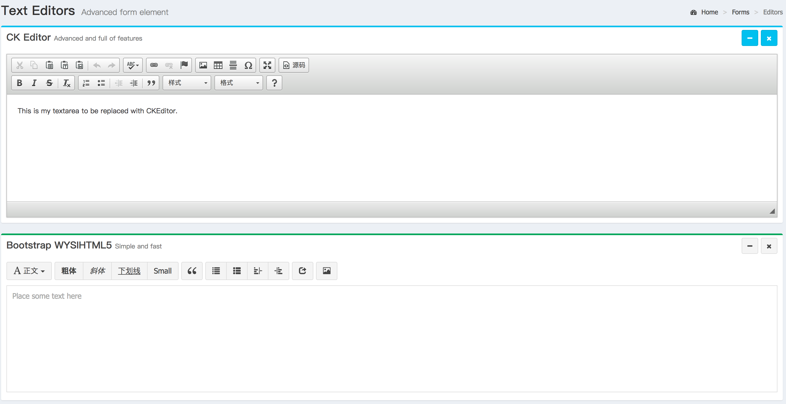
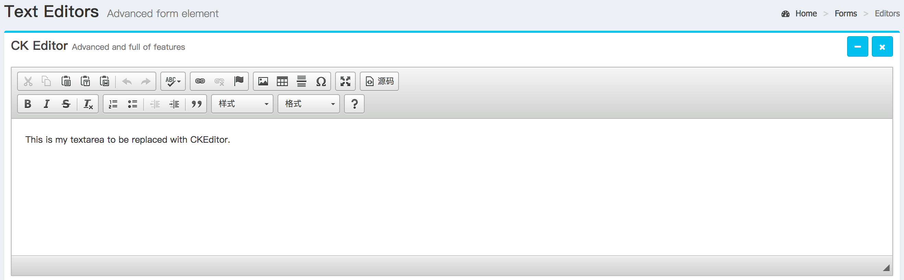
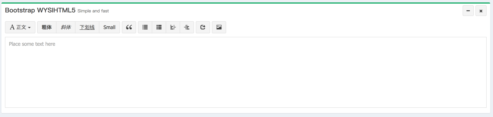

# 编辑器-Editor

## 前言


--------------------------------------------


> 中文说明
-    文本编辑器
> 英文说明
-    the leading rich text editor with powerful features and exceptional reliability
## 参考文

[ck-editor官址](http://ckeditor.com/)

[ck-editor文档](http://docs.ckeditor.com/#!/guide/dev_configuration)
## 功能特点
> 三种可选编辑器 ck-editor 、Bootstrap WYSIHTML5 、Markdown Editor 可根据不同需求选用 简单易用
-ckeditor
> 1.高质量（Quality）
- Years of continuous test-driven development (more than 5000 tests) and code peer review resulting in a mature product of the highest reliability. Maintained by a dedicated core development team supported by an active open source community, CKEditor is continuously advancing to be the most cutting edge online editor to date.
> 2.不断开拓创兴 （Innovation）
- Constantly leading innovation in the field of rich text editing. Take full control of your content creation process with such unique features as Paste from Word, Advanced Content Filter, widgets, custom HTML formatting and many more. Find out more  
> 3.高兼容的可访问性（Accessibility）
- Complying with the latest web accessibility standards (WCAG 2.0, Section 508, WAI-ARIA) and simultaneously enabling you to create accessible content thanks to a built-in Accessibility Checker. Find out more
> 4.可定制性 （Customizability）
- Customize every single detail of your editor and tailor it to your needs using its robust developer-friendly documentation and a rich JavaScript API. Find out more  
## 快速上手
-ck-editor
- 引用文件 js
> `<script src="ckeditor.js"></script>  //下载到本地引用`
> `<script src="http://research.itcast.cn/adminlte2-itcast/release/dist/plugins/ckeditor/ckeditor.js"></script>    //直接引用远程连接  也可以下载之后放到本地引用`
- 例子一（ckEditer）:

 
[查看效果](../img/editor/demo/demo1.html)

html
```html
<form>
    <textarea id="editor1" name="editor1" rows="10" cols="80">
            This is my textarea to be replaced with CKEditor.
    </textarea>
</form>
```
js
```js
CKEDITOR.replace('editor1');
```

-Bootstrap WYSIHTML5
- 引用文件 js css
    <link rel="stylesheet" href="http://research.itcast.cn/adminlte2-itcast/release/dist/plugins/bootstrap/css/bootstrap.min.css">
    <link rel="stylesheet" href="http://research.itcast.cn/adminlte2-itcast/release/dist/plugins/bootstrap-wysihtml5/bootstrap3-wysihtml5.min.css">
    <link rel="stylesheet" href="http://research.itcast.cn/adminlte2-itcast/release/dist/plugins/jvectormap/jquery-jvectormap-1.2.2.css">

    <script src="http://research.itcast.cn/adminlte2-itcast/release/dist/plugins/jQuery/jquery-2.2.3.min.js"></script>
    <script src="http://research.itcast.cn/adminlte2-itcast/release/dist/plugins/bootstrap/js/bootstrap.min.js"></script>
    <script src="http://research.itcast.cn/adminlte2-itcast/release/dist/plugins/bootstrap-wysihtml5/bootstrap3-wysihtml5.all.min.js"></script>
    <script src="http://research.itcast.cn/adminlte2-itcast/release/dist/plugins/bootstrap-wysihtml5/bootstrap-wysihtml5.zh-CN.js"></script>
- 例子二（Bootstrap WYSIHTML5）:
 

html
```html
    <div class="box-body pad">
        <form>
            <textarea class="textarea" placeholder="Place some text here" style="width: 100%; height: 200px; font-size: 14px; line-height: 18px; border: 1px solid #dddddd; padding: 10px;"></textarea>
        </form>
    </div>

```
js

```js
    $(".textarea").wysihtml5({
       locale: 'zh-CN'
   });
```


