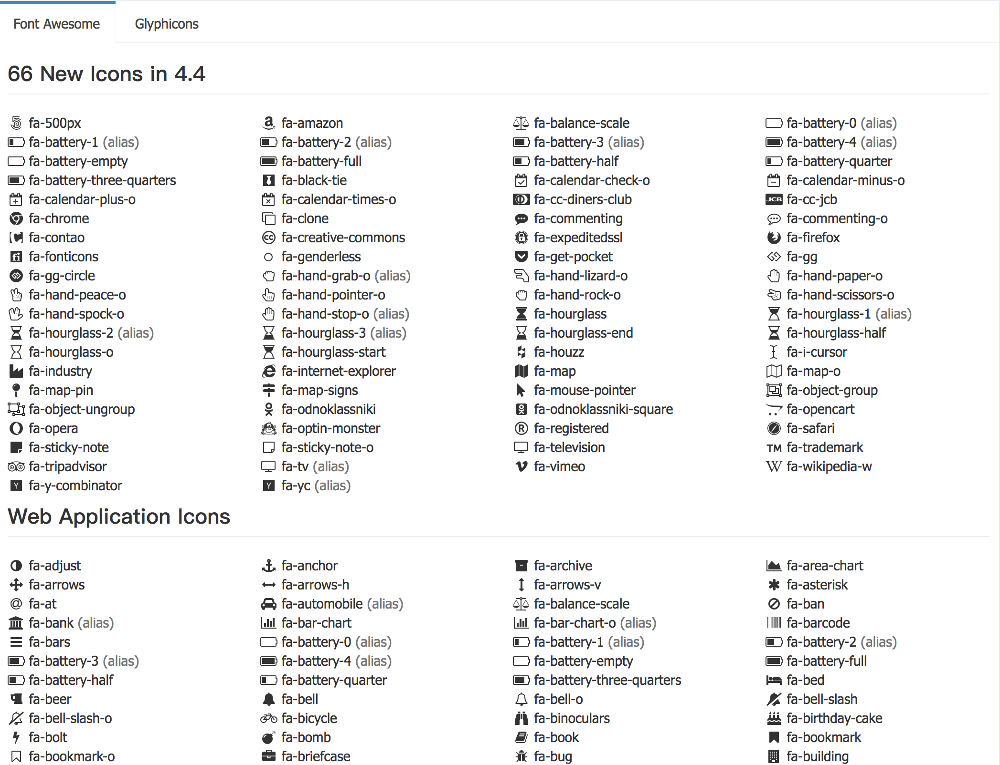
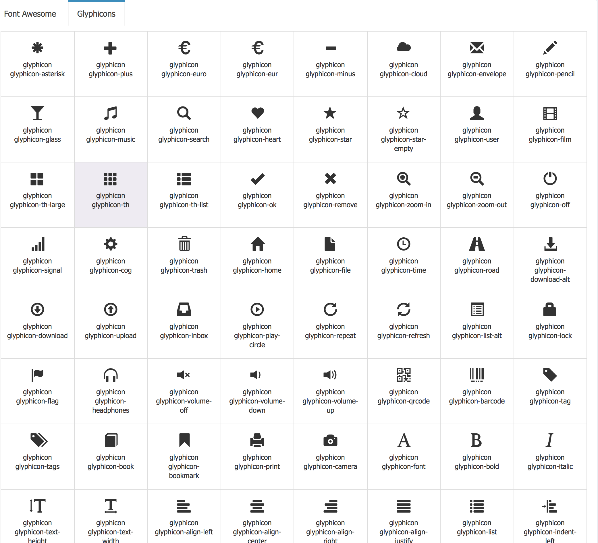

# 2.4.字体

> 本项目访问字体库文件 `font-awesome` `bootstrap-font（Glyphicons）` 避免了 `墙内` 无法下载，打开页面长时间`白屏`问题

- 1.font-awesome



### 用法: 

font-awesome 用法非常简单 只要在对应标签内部加上 对应的图标的class 就可以显示出你想要的图标


```html

<i class="fa fa-fw fa-battery-1"></i>      

```

> fa fa-fw 是必选的class  最后一个是对应图标的class 可对应[文档](http://research.itcast.cn/adminlte2-itcast/release/dist/pages/all-elements-icons.html)查找

- 2 Glyphicons 

> Glyphicons 是与bootstrap合作并免费提供给 bootstrap 使用的Icon图标库  

  

### 用法：

Glyphicons 与font-awesome 用法类似 只要在对应标签内部加上 对应的图标的class 就可以显示出你想要的图标

```html

<span class="glyphicon glyphicon-film"></span>

```
> glyphicon 是Glyphicons的必选的class  最后一个是对应图标的class 可对应[文档](http://research.itcast.cn/adminlte2-itcast/release/dist/pages/all-elements-icons.html)查找

> 图标后是 对应的图标的Class 记得不要忘了加必选的class
