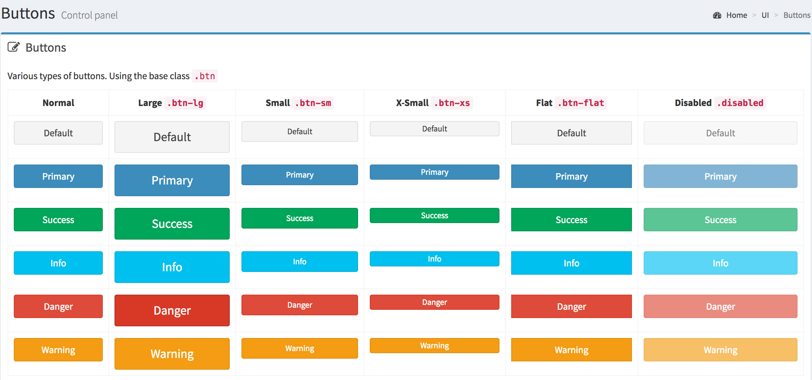
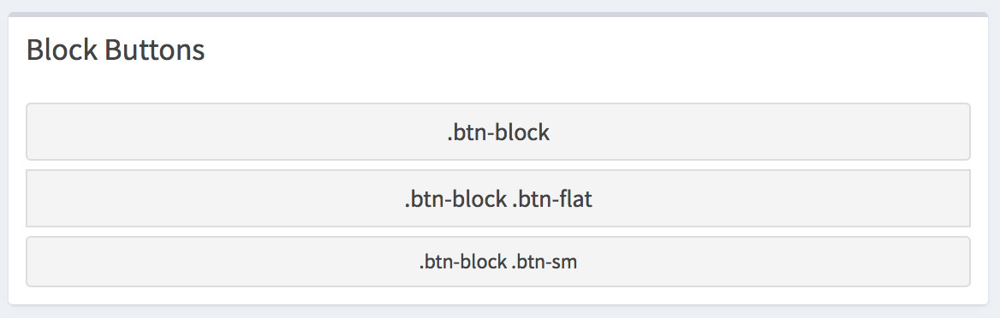
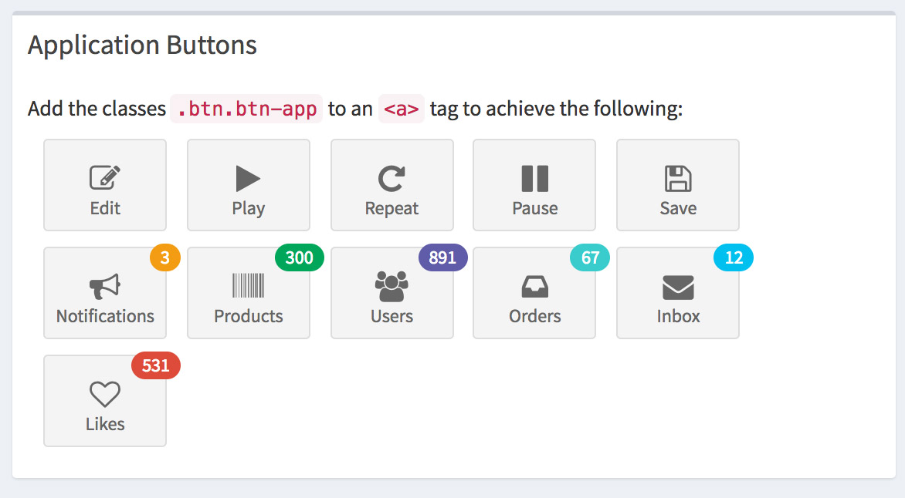
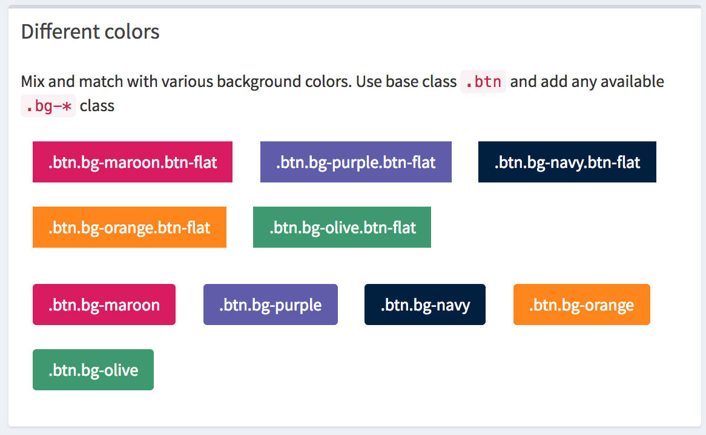
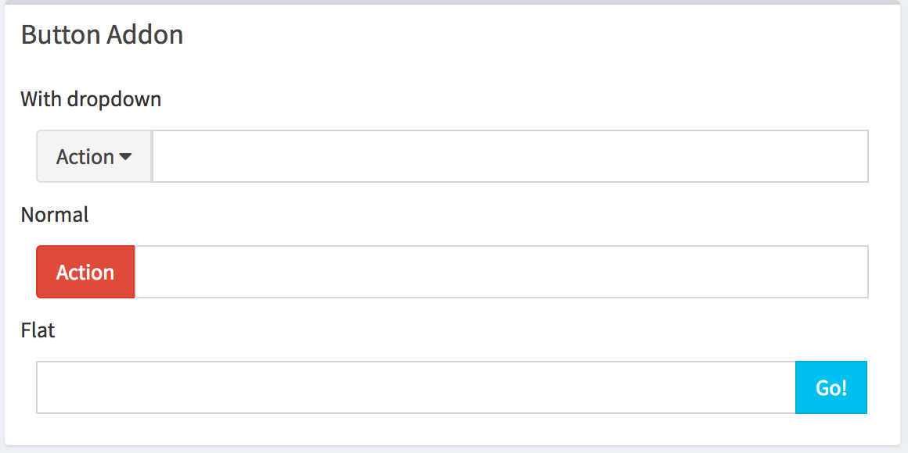
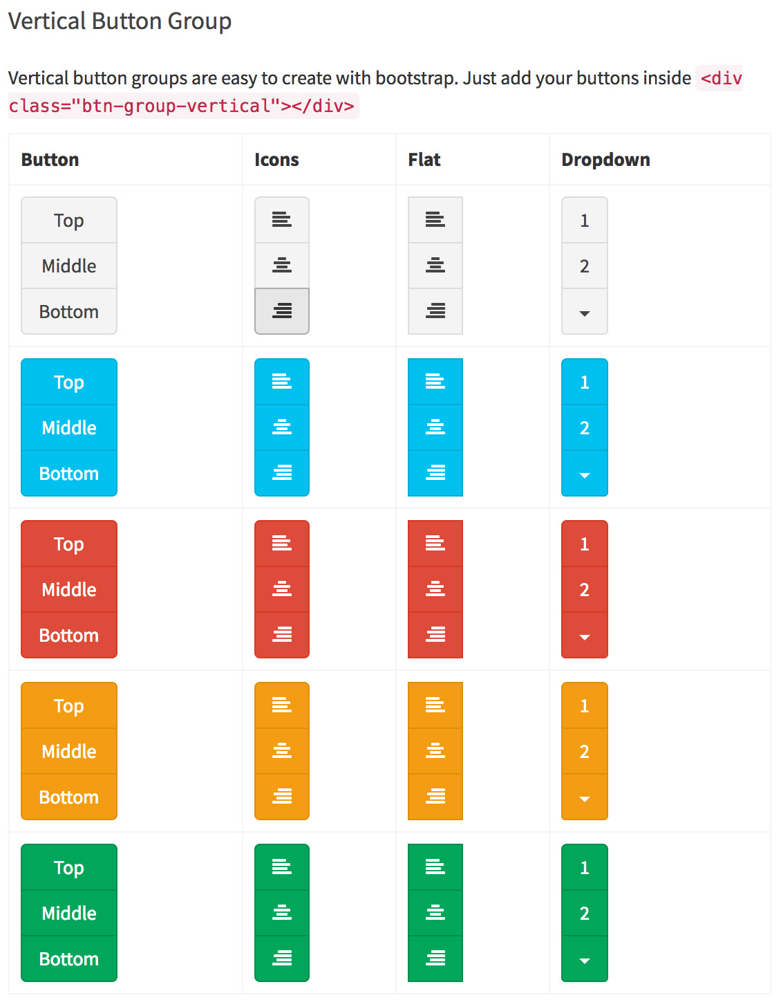
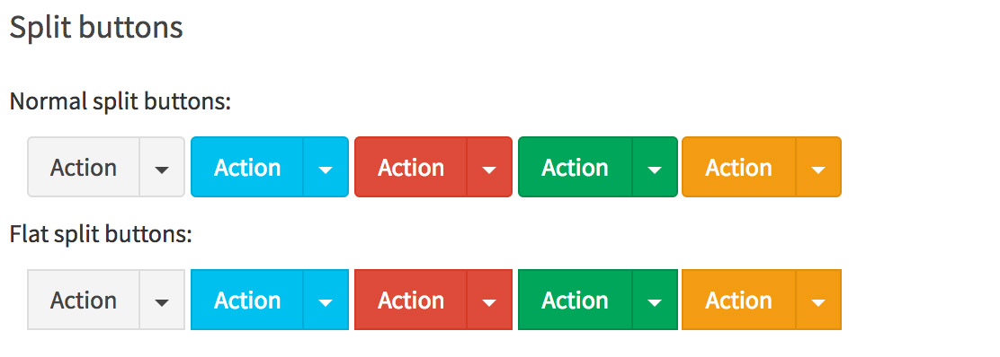
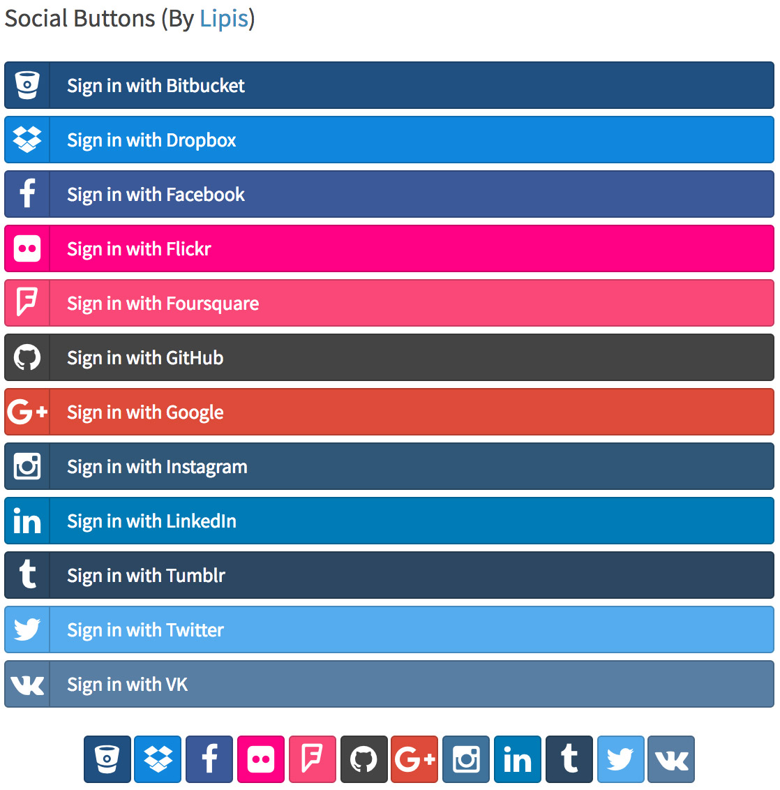

# 2.5.按钮

> AdminLTE 按钮分为以下九种按钮控件
> Buttons、Block Buttons、Application Buttons、Horizontal Button Group、Different colors、Button Addon、Vertical Button Group、Split buttons、Social Buttons (By Lipis)

- Buttons    



> Buttons 默认为六种状态 分别为 default、primary、success、info、danger、warning 每种可设置不同的大小样式
> 具体实现代码 请查看 ../release/dist/pages/all-elements-buttons.html

用法： 默认添加样式 btn btn-block 以及添加需要用到的状态 btn-default；使用不同大小样式时只需加上对应样式

使用六种状态方法

```html
<button type="button" class="btn btn-block btn-default">Default</button>

```

使用不同大小样式时只需加上对应样式

```html
<button type="button" class="btn btn-block btn-default btn-lg">Default</button>

```


- Block Buttons



用法与上面的基本一致 只需添加对应样式即可达到效果

```html
<button type="button" class="btn btn-default btn-block btn-flat">Default</button>

```

- Application Buttons



```html
<a class="btn btn-app">
    <i class="fa fa-edit"></i> Edit
</a>
```

- Horizontal Button Group


```html
<div class="btn-group">
     <button type="button" class="btn btn-default"><i class="fa fa-align-left"></i></button>
     <button type="button" class="btn btn-default"><i class="fa fa-align-center"></i></button>
     <button type="button" class="btn btn-default"><i class="fa fa-align-right"></i></button>
</div>
```
 
- Different colors



```html
<button type="button" class="btn bg-maroon btn-flat margin">.btn.bg-maroon.btn-flat</button>
```

- Button Addon



```html

<div class="input-group margin">
    <div class="input-group-btn">
        <button type="button" class="btn btn-default dropdown-toggle" data-toggle="dropdown">Action
        <span class="fa fa-caret-down"></span></button>
        <ul class="dropdown-menu">
            <li><a href="#">Action</a></li>
            <li><a href="#">Another action</a></li>
            <li><a href="#">Something else here</a></li>
            <li class="divider"></li>
            <li><a href="#">Separated link</a></li>
        </ul>
    </div>
    <input type="text" class="form-control">
</div>

```

- Vertical Button Group



```html
<div class="btn-group-vertical">
    <button type="button" class="btn btn-default">Top</button>
    <button type="button" class="btn btn-default">Middle</button>
    <button type="button" class="btn btn-default">Bottom</button>
</div>

````

- Split buttons



```html
<div class="btn-group">
    <button type="button" class="btn btn-default">Action</button>
    <button type="button" class="btn btn-default dropdown-toggle" data-toggle="dropdown">
<span class="caret"></span>
<span class="sr-only">Toggle Dropdown</span>
</button>
    <ul class="dropdown-menu" role="menu">
        <li><a href="#">Action</a></li>
        <li><a href="#">Another action</a></li>
        <li><a href="#">Something else here</a></li>
        <li class="divider"></li>
        <li><a href="#">Separated link</a></li>
    </ul>
</div>
````

- Social Buttons (By Lipis)



```html
<a class="btn btn-block btn-social btn-bitbucket">
    <i class="fa fa-bitbucket"></i> Sign in with Bitbucket
</a>
````


> 使用方法基本相同  按照固定的样式进行嵌套 灵活使用不同状态的样式 将更好的控制显示的方式 达到我们想要的效果
