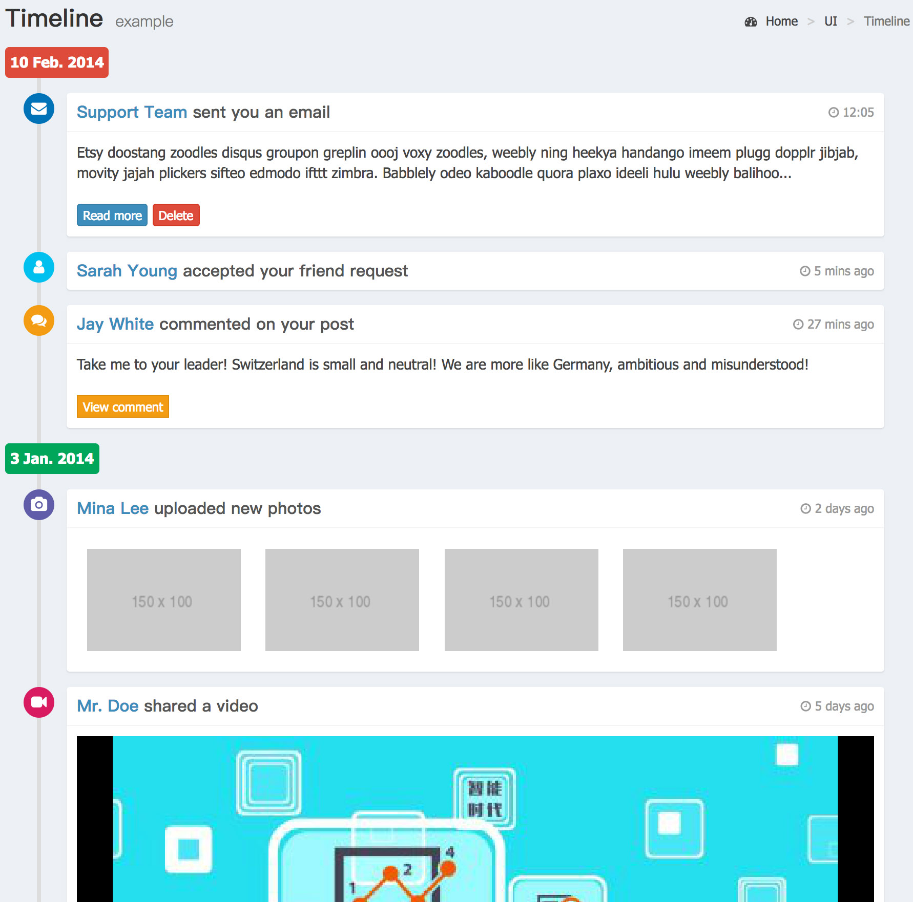

# 2.6.时间线(TimeLine)



- 按照固定格式嵌套标签 显示内容灵活掌握  

```html
<ul class="timeline">

    <!-- labe标签 定义时间节点 （timeline time label） -->
    <li class="time-label">
        <span class="bg-red">
            10 Feb. 2014  
        </span>
    </li>
    <!-- /.timeline-label -->

    <!-- 时间节点内 事项列   timeline item -->
    <li>
        <!-- 每项的icon图标  timeline icon -->
        <i class="fa fa-envelope bg-blue"></i>  
        <!-- 每项的具体内容想  右侧显示内容  timeline icon -->
        <div class="timeline-item">
            <span class="time"><i class="fa fa-clock-o"></i>12:05</span>

            <h3 class="timeline-header"><a href="#">Support Team</a> ...</h3>

            <div class="timeline-body">
                ...
                Content goes here
            </div>

            <div class="timeline-footer">
                <a class="btn btn-primary btn-xs">...</a>
            </div>
        </div>
    </li>
    <!-- END timeline item -->

    ...

</ul>
                  
```
