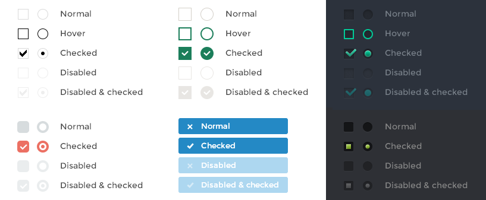
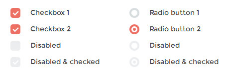

# 组件名称一级标题



这里是文档简介。这里是文档简介。这里是文档简介。这里是文档简介。这里是文档简介。

Englist introduction,Englist introduction,Englist introduction,Englist introduction,Englist introduction.

## 参考文档

[官方网址]( https://datatables.net/ ) 

[中文网址](http://www.datatables.club/)

## 二级标题

二级内容简介。二级内容简介。二级内容简介。二级内容简介。二级内容简介。二级内容简介。二级内容简介。二级内容简介。二级内容简介。二级内容简介。二级内容简介。二级内容简介。

列表样式一标题说明：

- `icheck.js` 列表一文字，列表一文字，列表一文字，列表一文字

  列表一补充说明。 列表一补充说明。 列表一补充说明。 列表一补充说明。 列表一补充说明。

- `icheck.js` 列表一文字，列表一文字，列表一文字

   列表一补充说明。 列表一补充说明。 列表一补充说明。 列表一补充说明。 列表一补充说明。

- **需要强调的文字** **需要强调的文字** *需要强调的文字* ***需要强调的文字*** 列表一文字

   列表一补充说明。 列表一补充说明。 列表一补充说明。 列表一补充说明。 列表一补充说明。

列表样式二标题说明：

- 列表二文字，列表二文字，列表二文字，列表二文字，列表二文字

  - 列表内层说明。列表内层说明。列表内层说明。列表内层说明。列表内层说明。列表内层说明。

    - 三级样式三级样式三级样式三级样式三级样式三级样式三级样式
 
- 列表二文字，列表二文字，列表二文字，列表二文字，列表二文字

  - 列表内层说明。列表内层说明。列表内层说明。列表内层说明。列表内层说明。列表内层说明。

    - 三级样式三级样式三级样式三级样式三级样式三级样式三级样式
  
列表样式三标题说明：

1. 列表三文字，列表三文字，列表三文字，列表三文字，列表三文字

   列表内层说明。列表内层说明。列表内层说明。列表内层说明。列表内层说明。列表内层说明。
 
2. 列表三文字，列表三文字，列表三文字，列表三文字，列表三文字

   列表内层说明。列表内层说明。列表内层说明。列表内层说明。列表内层说明。列表内层说明。

## 示例一：checkbox与radio



**引入文件** :

   ```js
    <script src="../../plugins/jQuery/jquery-2.2.3.min.js"></script>
    <script src="../../plugins/datatables/jquery.dataTables.min.js"></script>
    <script src="../../bootstrap/js/bootstrap.min.js"></script>				
   ```

   **html** :
   
   ```html
    <table id="ajax-table" class="table table-bordered table-hover">
        <thead>
            <tr>
                <td>序号</td>
                <td>标题</td>
                <td>链接</td>
            </tr>
        </thead>
    </table>				
   ```

   **check.js**:

   ```js
    /*
    *
    * 这是一个 reducer，形式为 (state, action) => state 的纯函数。
    *
    * state 的形式取决于你，可以是基本类型、数组、对象、
    *
    * 下面例子使用 `switch` 语句和字符串来做判断，但你可以写帮助类(helper)
    */
    function counter(state = 0, action) {
        switch (action.type) {
        case 'INCREMENT':
            return state + 1;
        case 'DECREMENT':
            return state - 1;
        default:
            return state;
        }
    }

    let preloadedState = { counter }  // 得到初始 state
    const store = createStore(counterApp, preloadedState)  // 创建新的 Redux store 实例
```
   
该示例简要说明。该示例简要说明。该示例简要说明。该示例简要说明。该示例简要说明。该示例简要说明。

表格说明。表格说明。表格说明。

事件名称 | 使用时机
-------- | ------
ifClicked | 用户点击了自定义的输入框或与其相关联的label
ifChanged | 输入框的 checked 或 disabled 状态改变了
ifChecked | 输入框的状态变为 checked
ifUnchecked | checked 状态被移除

> 补充说明。补充说明。补充说明。补充说明。补充说明。补充说明。补充说明。补充说明。补充说明。

- [ ] **待办事宜列表**
  - [ ] 待办事项一
  - [ ] 待办事项一
  - [x] 已办事项一
  - [x] 已办事项二

